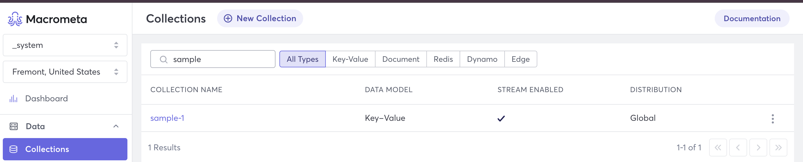
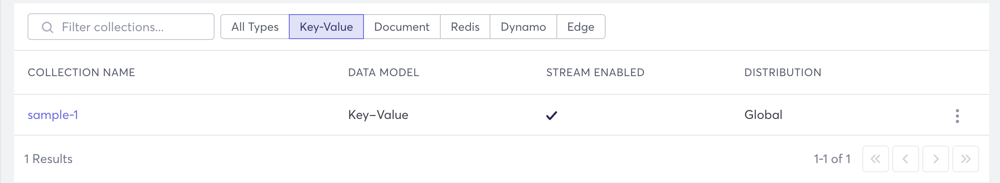

import Tabs from '@theme/Tabs';
import TabItem from '@theme/TabItem';

Collections form the basis for interacting with the Macrometa GDN, allowing you to perform various actions on your data. Let's go over some tasks you can perform with collections. 

## Create a New Collection

When viewing your collections, you can click **New Collection** to create a new collection. 

- [Create a Document  Collection](../collections/types-collections/documents/create-document-store.md)
- [Create a Key-Value  Collection](../collections/types-collections/keyvalue/create-key-value-store.md)
- [Create a Redis Mode](redis-mode/create-redis-mode)
- [Create a Dynamo Table](dynamo/create-dynamo-table.md)
- [Create a Graph Edge](../graphs/graph-tasks/create-graph-edge-collection.md)

## View Collections

<Tabs groupId="operating-systems">
<TabItem value="console" label="Web Console">

1. [Log in to your Macrometa account](https://auth-play.macrometa.io/).
1. Click **Data > Collections**.

This displays a list of collections. The following columns show information about each collection.

| Field Name  | Description  |
|---|---|
| Collection Name  | The list of all collections you have access to, sorted alphabetically.  |
| Data Model  | Displays the type of each collection.  |
| Stream Enabled  | Shows whether a collection stream is enabled (Yes) or not enabled (No). You can change this in the collection Data tab.  |
| Distribution  | When a collection is created, it can be locally or globally distributed across Macrometa servers. This section displays the distribution type for your collections - Local or Global.  |
| Filter Collections | If you have many collections, then it can be helpful to filter your collection list so that you have fewer to sort through. |

### Filter Collections

The GDN allows you to filter collections by _name_ or by _type_.

- **Filter Collections by Name :** Enter the name of the collection into the search bar to filter your collections.



- **Filter Collections by Type :** Click on the desired collection type to get a list of all the collections matching the type. The following filters for key-value collections.



</TabItem>
<TabItem value="apo" label="REST API">

Use our interactive API Reference to:

- [List All Collections](https://www.macrometa.com/docs/api#/operations/handleCommandGet)
- [Get Information About a Collection](https://www.macrometa.com/docs/api#/operations/handleCommandGet:collectionGetProperties)
- [Get Number of Documents in a Collection](https://www.macrometa.com/docs/api#/operations/handleCommandGet:getCollectionCount)

</TabItem>
<TabItem value="cli" label="CLI">

Use the [gdnsl collection list](../cli/collections-cli#gdnsl-collection-list) CLI command to see what collections exist.

Use the [gdnsl collection describe](../cli/collections-cli#gdnsl-collection-describe) CLI command to learn more about a specific collection.

Output from these commands looks similar to the following:

```bash
MacBook-Pro ~ % gdnsl collection list
┌────────┐
│ Name   │
├────────┤
│ edges  │
│ docs   │
│ dynamo │
│ kv     │
│ redis  │
└────────┘

MacBook-Pro ~ % gdnsl collection describe kv

{
  "error": false,
  "code": 200,
  "waitForSync": false,
  "name": "kv",
  "isSystem": false,
  "isSpot": false,
  "isLocal": false,
  "status": 3,
  "searchEnabled": false,
  "id": "27025010960",
  "type": 2,
  "hasStream": true,
  "globallyUniqueId": "hC835CABCFA79/27025010960",
  "collectionModel": "KV"
}
```

</TabItem>
</Tabs>

## Truncate a Collection

Truncating a collection removes all the documents from the collection but leaves the indexes in place. This is available for all collection types, except a Dynamo Table. 

To truncate a collection:

1. Log in to your [Macrometa account](https://auth-play.macrometa.io/).
1. Click **Data > Collections**.
1. Click the collection that you want to truncate.
1. Click **Settings**.
1. In the Settings tab, click **Truncate Collection**.


## Delete a Collection 

Unlike truncating a collection, deleting a collection removes all the content, including the indexes. 

To delete a collection:
 
1. Log in to your [Macrometa account](https://auth-play.macrometa.io/).
1. Click **Data > Collections**.
1. Click the collection that you want to delete.
1. Click **Settings**.
1. In the Settings tab, click **Delete Collection**.


