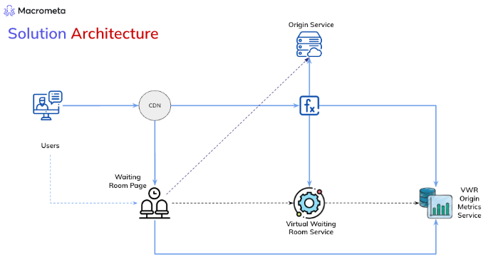

Macrometa PhotonIQ Virtual Waiting Rooms (VWRs) are an advanced prioritization service that manages the flow of visitors entering a site, especially during periods of high demand. It serves as a protective layer for your origin server, effectively managing high traffic volumes to prevent server overload.

## Solution Overview

The waiting room solution includes these essential aspects:

- **Origin Service**: The website for which you want to set up a virtual waiting room.
- **Origin Metrics Service**: Allows you to retrieve information about a specific waiting room.
- **Waiting Room Page**: The endpoint (URL) with the waiting room attached.

## The VWR Workflow

During moments of peak traffic, VWRs creates a new HTML page separate from your origin to organize visitors. This room employs a workflow that directs users to the appropriate origin service while ensuring fairness when removing users from the queue and providing metrics and alerts to the administrator. The workflow proceeds as follows:

1. The Akamai EdgeWorker checks the virtual waiting room service to confirm if a waiting room is set up for an origin service

    - If no waiting room, the EdgeWorker sends the traffic request directly to the origin service.
    - If there is a waiting room, the EdgeWorker sends to the waiting room.

3. The waiting room service adds the request to the waiting room associated with the domain.
4. When a user accesses the waiting room page, the page polls the virtual waiting room service for the latest waiting time and waiting room depth and displays it.
6. As the waiting time nears zero, or the user is at the front of the queue, the waiting room page forwards the user to the origin service.
7. After releasing the request, the waiting room service removes a request from the queue.
8. If a duplicate request is detected, then the waiting room service checks to see if the user has an active session.
    - If yes, then the waiting room service returns the user's position in the queue. 
    - If no, then the waiting room service creates a new session and adds the request to the appropriate queue.
    

:::note

- The waiting room service periodically checks the sessions to remove requests for expired sessions from the queues.
- The waiting room service collects the metrics for each waiting room.
- The administrator can turn customer domains on or off through Configuration APIs.
- VWR uses a queue to serve user requests based on join time. You can configure the queue to be FIFO, random, or lottery based.

:::
