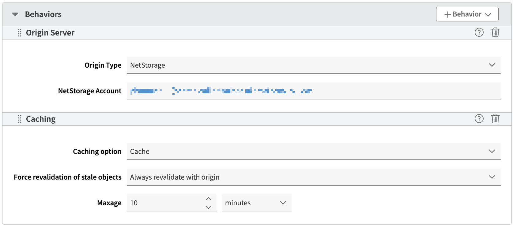

The VWRs waiting room page is a customizable HTML page that users see when they are directed to the waiting room. The waiting room page is hosted on the Akamai NetStorage and configured using the `waitingRoomPath` option in the VWRs EdgeWorker `handleVwrsRequest()` function.

Here is an example of such a page:


Below is the template code for the page:
```html
<!DOCTYPE html>
<html lang="en">
  <head>
    <meta charset="UTF-8" />
    <meta name="viewport" content="width=device-width, initial-scale=1.0" />
    <title>Virtual Waiting Room</title>
    <style>
      * {
        box-sizing: border-box;
        margin: 0;
        padding: 0;
      }
      body {
        align-items: flex-start;
        background-color: #f1f2f3;
        background-image: radial-gradient(
          farthest-corner,
          #f1f2f3 10%,
          #d7e1ec 100%
        );
        display: flex;
        font-family: -apple-system, BlinkMacSystemFont, "Segoe UI", Roboto,
          Helvetica, Arial, sans-serif, "Apple Color Emoji", "Segoe UI Emoji",
          "Segoe UI Symbol";
        justify-content: center;
        margin: 0;
        min-height: 100vh;
        padding: 1rem;
      }
      .container {
        background-color: #ffffff;
        border-radius: 12px;
        box-shadow: rgba(50, 50, 93, 0.1) 0px 30px 60px -12px, rgba(
              0,
              0,
              0,
              0.2
            ) 0px 18px 36px -18px;
        max-width: 672px;
        padding: 2.5rem 1.5rem 1.5rem;
        text-align: center;
      }
      h1 {
        font-size: 1.5rem;
        font-weight: 600;
        letter-spacing: 0.0125rem;
        margin-bottom: 1.25rem;
      }
      p {
        color: #383b46;
        margin: 1rem 0;
        line-height: 1.5rem;
      }
      .details {
        border-radius: 8px;
        display: flex;
        flex-direction: column;
        justify-content: center;
      }
      .details > div {
        margin: 0 1rem;
        padding: 0.5rem;
      }
      .details p {
        color: #535968;
        margin: 0;
      }
      .details p.value {
        color: #383b46;
        font-size: 1.25rem;
        font-weight: 600;
        letter-spacing: 0.025rem;
        line-height: 1.5rem;
        margin-top: 0.25rem;
      }
      .small {
        color: #6f768b;
        font-size: 0.875rem;
      }

      @keyframes striping {
        100% {
          background-position: 100% 100%;
        }
      }

      @media only screen and (min-width: 768px) {
        body {
          align-items: center;
        }
        h1 {
          font-size: 2rem;
        }
        p {
          font-size: 0.9375rem;
        }
        .container {
          padding: 2.5rem 3rem 1.5rem;
          text-align: center;
        }
        .details {
          flex-direction: row;
        }
      }
    </style>
    <script>
      function fetchData() {
        fetch(`${window.location.href}/status`)
          .then((res) => {
            const status = res.status;
            if (status === 302) {
              // it is ok to go to origin now
              showRedirectionMessage();
              window.location.reload();
            }
            return res.json();
          })
          .then(renderData)
          .catch((err) => {
            console.error("Error fetching data:", err);
          });
      }

      function formatNumber(num) {
        return num
          ? num.toString().replace(/\\B(?=(\\d{3})+(?!\\d))/g, ",")
          : "";
      }

      function formatSeconds(seconds) {
        seconds = Number(seconds);
        const d = Math.floor(seconds / (3600 * 24));
        const h = Math.floor((seconds % (3600 * 24)) / 3600);
        const m = Math.floor((seconds % 3600) / 60);
        const s = Math.floor(seconds % 60);

        const dDisplay = d > 0 ? d + (d == 1 ? " day, " : " days, ") : "";
        const hDisplay = h > 0 ? h + (h == 1 ? " hour, " : " hours, ") : "";
        const mDisplay = m > 0 ? m + (m == 1 ? " minute, " : " minutes, ") : "";
        const sDisplay = s > 0 ? s + (s == 1 ? " second" : " seconds") : "";
        return dDisplay + hDisplay + mDisplay + sDisplay;
      }

      function showRedirectionMessage() {
        const waiting = document.getElementById("waiting");
        waiting.style.visibility = "hidden";

        const redirecting = document.getElementById("redirecting");
        redirecting.style.visibility = "visible";
      }

      function renderData(data) {
        if (data.position === 0) {
          showRedirectionMessage();
          window.location.reload();
        }

        const depth = data?.queue_depth || 0;
        const position = data?.position || 0;
        const wait = data?.avg_waiting_time || 0;

        document.getElementById("avg-wait-time").innerText =
          formatSeconds(wait);
        document.getElementById("queue-position").innerText =
          formatNumber(position);
        document.getElementById("queue-depth").innerText = formatNumber(depth);

        document.getElementById("req-id").innerText = data.reqId;
      }

      function startPolling() {
        fetchData();
        setInterval(fetchData, 1 * 1000);
      }
    </script>
  </head>
  <body onload="startPolling()">
    <div class="container">
      <h1>Virtual Waiting Room</h1>
      <div id="waiting">
        <p>
          Thank you for your patience. We are currently experiencing a high
          volume of visitors. You will be automatically redirected when it is
          your turn.
        </p>
        <div class="details">
          <div>
            <p>Visitors ahead of you:</p>
            <p class="value" id="queue-position"></p>
          </div>
          <div>
            <p>Visitors in the queue:</p>
            <p class="value" id="queue-depth"></p>
          </div>
        </div>
        <p class="small">
          Estimated wait time: <span id="avg-wait-time"></span>
        </p>
      </div>
      <p class="small">Request Id: <span id="req-id"></span></p>
      <p class="small" id="redirecting" style="visibility: hidden">
        You are being redirected. Thank you for your patience...
      </p>
    </div>
  </body>
</html>
```

Within the above template, the class attributes `queue-position`, `queue-depth`, and `avg-wait-time` displays the visitor's current position in the queue, the total number of users in the waiting room, and the average waiting time, respectively.

## Configuring the Waiting Room Page

The waiting room path must be configured as a [Conditional Origin](https://techdocs.akamai.com/property-mgr/docs/conditional-origins) in Akamai's property manager. This allows the waiting room HTML page to be served from the Akamai NetStorage. 

Configure the conditional origin with the following settings:

- Set the Origin ID to `waitingroom`.

In the behaviors section:

  **Origin Server**:

  - Set the Origin type to Netstorage.
  - Set the NetStorage Account to the appropriate account.

  **Caching**:

  - Caching option: cache
  - Force revalidation of stale objects: Always revalidate the origin
  - Maxage: 10 minutes


