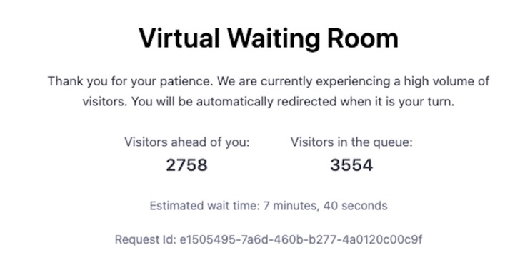

Customizing your waiting room helps improve the waiting experience for users by ensuring:
- Consistency: Using brand colors and design in your waiting room reinforces your brand identity and improves recognition for your users even while in the queue, ensuring a consistent, cohesive, and seamless user experience.
- Fostering trust and credibility: Incorporating visual elements like logos, colors, typography, and imagery with brand messaging, tone of voice, and values builds brand trust and credibility, ultimately improving loyalty and customer engagement.

### Uploading your Waiting Room Page

After [adding a NetStorage group]((https://techdocs.akamai.com/netstorage/docs/create-a-storage-group)) and [creating a new upload account](https://techdocs.akamai.com/netstorage/docs/create-an-upload-account), follow these steps to upload your waiting room HTML page.
1. Click on **File Manager** 
1. Click on the target folder that will serve the HTML page. This opens a new page.

Note: **This folder also acts as the NetStorage account provided when configuring the origin in the property manager.**
3. Click on **Upload** and select the waiting room HTML file.

Below is the template code for the virtual waiting room page:
```HTML
<!DOCTYPE HTML>
<HTML lang="en">
  <head>
    <meta charset="UTF-8" />
    <meta name="viewport" content="width=device-width, initial-scale=1.0" />
    <title>Virtual Waiting Room</title>
    <style>
      * {
        box-sizing: border-box;
        margin: 0;
        padding: 0;
      }
      body {
        align-items: flex-start;
        background-color: #f1f2f3;
        background-image: radial-gradient(
          farthest-corner,
          #f1f2f3 10%,
          #d7e1ec 100%
        );
        display: flex;
        font-family: -apple-system, BlinkMacSystemFont, "Segoe UI", Roboto,
          Helvetica, Arial, sans-serif, "Apple Color Emoji", "Segoe UI Emoji",
          "Segoe UI Symbol";
        justify-content: center;
        margin: 0;
        min-height: 100vh;
        padding: 1rem;
      }
      .container {
        background-color: #ffffff;
        border-radius: 12px;
        box-shadow: rgba(50, 50, 93, 0.1) 0px 30px 60px -12px, rgba(
              0,
              0,
              0,
              0.2
            ) 0px 18px 36px -18px;
        max-width: 672px;
        padding: 2.5rem 1.5rem 1.5rem;
        text-align: center;
      }
      h1 {
        font-size: 1.5rem;
        font-weight: 600;
        letter-spacing: 0.0125rem;
        margin-bottom: 1.25rem;
      }
      p {
        color: #383b46;
        margin: 1rem 0;
        line-height: 1.5rem;
      }
      .details {
        border-radius: 8px;
        display: flex;
        flex-direction: column;
        justify-content: center;
      }
      .details > div {
        margin: 0 1rem;
        padding: 0.5rem;
      }
      .details p {
        color: #535968;
        margin: 0;
      }
      .details p.value {
        color: #383b46;
        font-size: 1.25rem;
        font-weight: 600;
        letter-spacing: 0.025rem;
        line-height: 1.5rem;
        margin-top: 0.25rem;
      }
      .small {
        color: #6f768b;
        font-size: 0.875rem;
      }

      @keyframes striping {
        100% {
          background-position: 100% 100%;
        }
      }

      @media only screen and (min-width: 768px) {
        body {
          align-items: center;
        }
        h1 {
          font-size: 2rem;
        }
        p {
          font-size: 0.9375rem;
        }
        .container {
          padding: 2.5rem 3rem 1.5rem;
          text-align: center;
        }
        .details {
          flex-direction: row;
        }
      }
    </style>
    <script>
      function fetchData() {
        fetch(`${window.location.href}/status`)
          .then((res) => {
            const status = res.status;
            if (status === 302) {
              // it is ok to go to origin now
              showRedirectionMessage();
              window.location.reload();
            }
            return res.json();
          })
          .then(renderData)
          .catch((err) => {
            console.error("Error fetching data:", err);
          });
      }

      function formatNumber(num) {
        return num
          ? num.toString().replace(/\\B(?=(\\d{3})+(?!\\d))/g, ",")
          : "";
      }

      function formatSeconds(seconds) {
        seconds = Number(seconds);
        const d = Math.floor(seconds / (3600 * 24));
        const h = Math.floor((seconds % (3600 * 24)) / 3600);
        const m = Math.floor((seconds % 3600) / 60);
        const s = Math.floor(seconds % 60);

        const dDisplay = d > 0 ? d + (d == 1 ? " day, " : " days, ") : "";
        const hDisplay = h > 0 ? h + (h == 1 ? " hour, " : " hours, ") : "";
        const mDisplay = m > 0 ? m + (m == 1 ? " minute, " : " minutes, ") : "";
        const sDisplay = s > 0 ? s + (s == 1 ? " second" : " seconds") : "";
        return dDisplay + hDisplay + mDisplay + sDisplay;
      }

      function showRedirectionMessage() {
        const waiting = document.getElementById("waiting");
        waiting.style.visibility = "hidden";

        const redirecting = document.getElementById("redirecting");
        redirecting.style.visibility = "visible";
      }

      function renderData(data) {
        if (data.position === 0) {
          showRedirectionMessage();
          window.location.reload();
        }

        const depth = data?.queue_depth || 0;
        const position = data?.position || 0;
        const wait = data?.avg_waiting_time || 0;

        document.getElementById("avg-wait-time").innerText =
          formatSeconds(wait);
        document.getElementById("queue-position").innerText =
          formatNumber(position);
        document.getElementById("queue-depth").innerText = formatNumber(depth);

        document.getElementById("req-id").innerText = data.reqId;
      }

      function startPolling() {
        fetchData();
        setInterval(fetchData, 1 * 1000);
      }
    </script>
  </head>
  <body onload="startPolling()">
    <div class="container">
      <h1>Virtual Waiting Room</h1>
      <div id="waiting">
        <p>
          Thank you for your patience. We are currently experiencing a high
          volume of visitors. You will be automatically redirected when it is
          your turn.
        </p>
        <div class="details">
          <div>
            <p>Visitors ahead of you:</p>
            <p class="value" id="queue-position"></p>
          </div>
          <div>
            <p>Visitors in the queue:</p>
            <p class="value" id="queue-depth"></p>
          </div>
        </div>
        <p class="small">
          Estimated wait time: <span id="avg-wait-time"></span>
        </p>
      </div>
      <p class="small">Request Id: <span id="req-id"></span></p>
      <p class="small" id="redirecting" style="visibility: hidden">
        You are being redirected. Thank you for your patience...
      </p>
    </div>
  </body>
</HTML>
```

Within the above template, the class attributes `queue-position`, `queue-depth`, and `avg-wait-time` displays the visitor's current position in the queue, the total number of users in the waiting room, and the average waiting time, respectively.

Here is the rendered HTML page for the above template code:




### Customizing your Waiting Room Page

You can edit this HTML template code by changing visual elements like the font-family, background-color and font-size while infusing brand language and voice to incorporate your brand style and aesthetics. This customization will ensure consistency and improve user waiting experiences. 