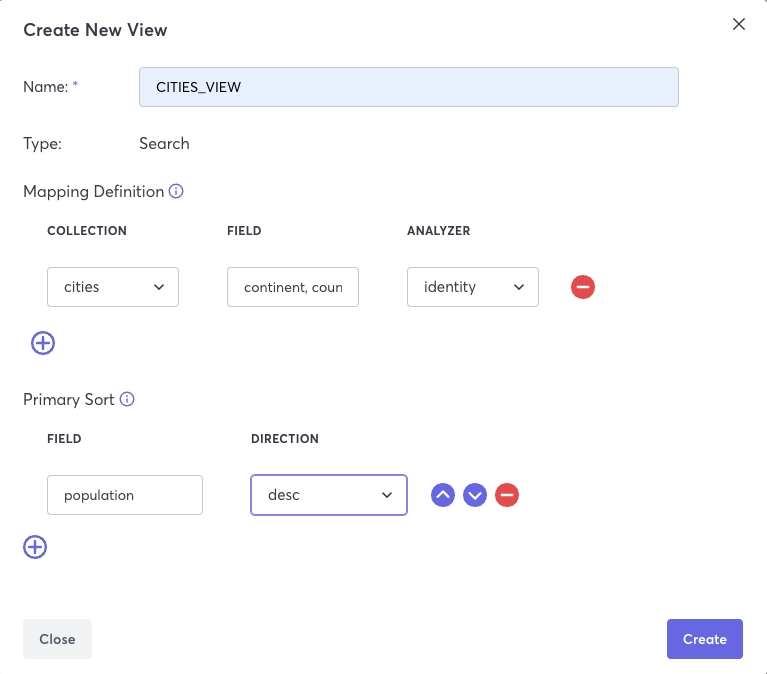

When the [`SORT`](/docs/queryworkers/c8ql/operations/sort) operation is used in a query, indexes will not utilized for the attributes specified in [`FILTER`](/docs/queryworkers/c8ql/operations/filter) conditions. An alternative solution is to create a [`SEARCH VIEW`](/docs/search/views/create-search-views) with the `FILTER` attributes in the mapping definition. Use the attribute on which you need to sort the results as the primary sort attribute when defining the `SEARCH VIEW`. The results will now be sorted and the `FILTER` conditions will utilize available indexes for greater performance.

*Note: Only one attribute can be added as a `Primary Sort` attribute. This attribute cannot be updated. To change this attribute the `Search View` must be rebuilt.*

## Example SORT Query without index utilization

```sql
FOR city in cities
   FILTER city.continent == "ASIA" AND
          city.country == "CHINA" AND
          city.type == "RURAL" AND
          city.population > 40000
   SORT city.population DESC     
   return { city : city}
```
## Example Search View Definition with Primary Sort



## Example Search View query with Primary Sort
```sql
FOR city in CITIES_VIEW
   SEARCH ANALYZER((city.continent == "ASIA" AND
          city.country == "CHINA" AND
          city.type == "RURAL" AND
          city.population > 40000 ), "identity")
   return { city : city}
```